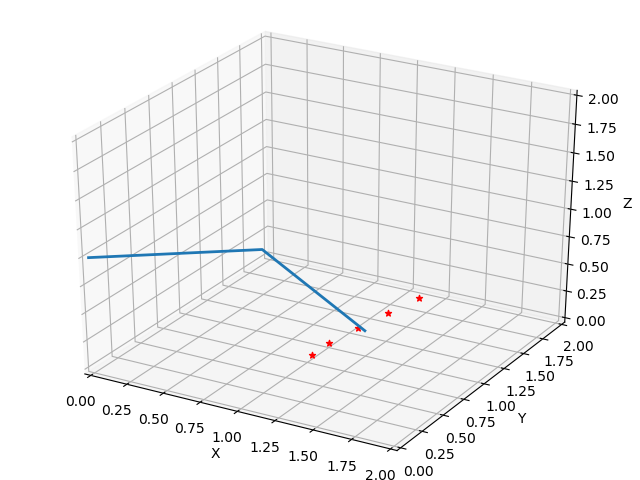
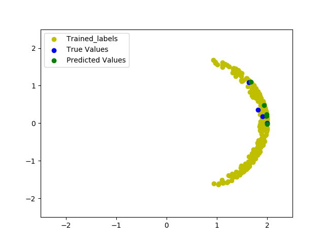

# Forward and Inverse Kinematics for Robotic Manipulator
Predicting Forward and Inverse Kinematics for Robotic Manipulator

Motivation: 

•	To develop a general n-revolute robotic arm class in python.

•	To implement the theory of kinematics, velocity analysis, dynamics, PID controller, and trajectory generation learned from the book of Craig.

•	Solve inverse kinematics using Deep Neural Network, because of there being no general solution to solve for inverse kinematics of a non-intersecting wrist arm.

Outcome

•	Developed a class of robotic arm, and PID controller.

•	Used animation to demonstrate the inverse kinematics and motion of the arm.

•	Developed a class of neural network, which can be used to generate NN of any number of nodes and hidden layers. Added sigmoid, linear, and RELU activation functions. 

•	Implemented the NN on a 2 link robotic arm. For 250 training data points, and NN of shape - [3, 5, 4] (nodes of Hidden layers 1,2, and 3) the error RMS for test data is about 1.05

